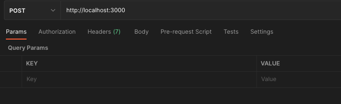
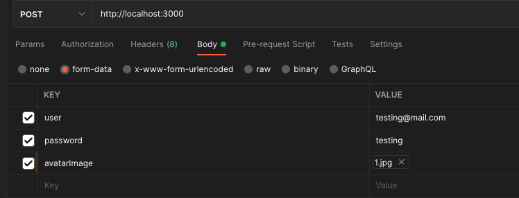

## Table of Content
1. [Prerequisites](#prerequisites)
1. [Intro to Form](#intro-to-form)
1. [Intro to FormData](#intro-to-formdata)
1. [Case Study](#case-study)
1. [Form Handling on Client](#form-handling-on-client)
    - [via Postman](#via-postman)
    - [via REST Client](#via-rest-client)
    - [via HTML5 Form](#via-html5-form)
1. [Form Handling on Server](#form-handling-on-server)
1. [References](#reference)

## Prerequisites
- Mengetahui HTTP Method dan konsep REST API
- Mengetahui penggunaan web app framework (seperti: Express, Fastify, dll)
- Mengetahui penggunaan HTTP Client (Postman, REST Client, dll)
- Mengetahui dasar dari HTML5 Form

## Intro to Form
Form atau formulir adalah sebuah bagian dari sebuah halaman web yang berisi  
beberapa inputan yang bertujuan untuk mengumpulkan input dari pengguna.

Inputan ini umumnya akan dikirimkan pada server untuk kemudian akan diproses.

Pada sisi client, cara untuk membuat form umumnya adalah sebagai berikut:
```html
<!-- Tag form  -->
<form method="..." action="...">
  <!-- Bagian input -->
  <div>
    <label for="...">...</label>
    <input type="..." name="..." id="...">
  </div>
  <!-- Bagian input selanjutnya -->
  ...
  <!-- Bagian submit button, wajib ada pada setiap form -->
  <div>
    <button type="submit"></button>
  </div>
</form>
```

Tanpa kita sadari, sebenarnya secara otomatis, pada form tersebut akan  
berisi sebuah attribut tambahan dengan nama `enctype`, yang memiliki   
default valuenya adalah `application/x-www-form-urlencoded`.

Jadi sebenarnya pada tag htmlnya, seharusnya adalah:
```html
<form method="..." action="..." enctype="application/x-www-form-urlencoded">
```

Nah sekarang pertanyaannya adalah, apakah `enctype` ini?

`enctype` ini sendiri adalah sebuah atribut yang menspesifikasikan tipe  
encoding untuk hasil data pada form agar dapat di"terjemahkan" ketika 
di-submit ke server.

jadi pada server mengetahui bahwa data yang dikirimkan adalah dalam bentuk  
`application/x-www-form-urlencoded`.

Dalam struktur HTTP, tipe encoding ini dapat dilihat dari header yang bernama   
`Content-Type`.

Contoh:
Misalkan dalam sebuah form, memiliki action yang akan mengarah pada server   
dengan  endpoint adalah POST /users, di mana server terletak pada  
 `http://localhost:3000` dan mengirimkan 2 data input dengan `name` adalah   
 `email` dan `password`.

Maka pada client, secara HTTP, data yang dikirimkan adalah sebagai berikut:
```http
# Endpoint
POST http://localhost:3000/users HTTP/1.1

# Headers
Content-Type: application/x-www-form-urlencoded

# Body
email=testing@mail.com&password=12345678
```

Namun untuk Content-Type `application/x-www-form-urlencoded`, data yang bisa  
dikirimkan hanyalah data berupa data sederhana saja, mis: text, number, boolean.

Bagaimanakah cara kita mengirimkan data berupa file, dan data file tersebut ada  
satu ataupun lebih?

Maka jawabannya kita tidak bisa menggunakan `application/x-www-form-urlencoded`,   
namun harus menggunakan `multipart/form-data`. 

Pada client, umumnya disebut dengan `FormData`.

## Intro to FormData
Pertanyaan paling mendasarnya sekarang adalah: apakah perbedaan antara   
`application/x-www-form-urlencoded` dan `multipart/form-data`?

Mengutip dari `w3.org`, `application/x-www-form-urlencoded` adalah tipe data yang  
tidak efisien untuk mengirimkan data yang banyak, khususnya data biner dan data  
non karakter ASCII. 

Tipe konten `multipart/form-data` digunakan untuk mengirimkan form yang memiliki   
`file` dan data `non karakter ASCII`.

Cara penulisannya pun menjadi cukup berbeda pada saat mengirimkan data.

Untuk itu, tanpa ba bi bu lama lama, mari kita coba untuk mempelajari bagaimana  
cara untuk mengirimkan FormData (Client to Server) dan menerima FormData   
(Server Handling).

## Case Study
Client ingin mengirimkan data dengan content-type `multipart/form-data` kepada   
server. Data ini berupa: 
- key `user` dengan value `testing@mail.com`, 
- key `password` dengan value `12345678`,
- key `avatarImage` yang mengirimkan sebuah image jpg dengan nama `1.jpg`

Server hanya dapat menerima data tersebut pada url `http://localhost:3000` dan  
endpoint berupa `POST /testing`.

Kamu sebagai developer, diminta untuk membuat atau menyelesaikan ini, baik dari  
client dengan menggunakan `Postman`, `REST Client`, dan Form HTML5 sederhana,  
dan dari sisi servernya, dengan menggunakan `nodejs`, dengan framework apapun.

## Form Handling on Client
Pada tahap pertama, kita akan mencoba untuk merangkai atau membuat dulu dari sisi  
clientnya dengan 3 cara yang diinginkan.

### via Postman
Pada Postman, kita akan membuat sebuah request baru dengan ketentuannya sebagai  
berikut:
1. Membuat sebuah request baru, dengan request method `POST` dan url  
   `http://localhost:3000/testing`
   
2. Pada bagian tab `Body`, pilih untuk menggunakan `form-data`, dengan key dan value
   sebagai berikut:
   - key `user` dengan value `testing@mail.com`
   - key `password` dengan value `12345678`
   - key `avatarImage` dengan **tipe data file** dan value sebuah image dengan nama 
     `1.jpg` 
   
3. Sampai dengan tahap ini artinya kita sudah selesai untuk membuatkan sebuah client  
   HTTP request dengan Postman, selanjutnya tinggal menunggu server untuk diselesaikan  
   kemudian baru kita bisa mencobanya yah !

### via REST Client
Pada REST Client (Extension pada VSCode), kita akan membuat sebuah request baru dengan
membuat sebuah file baru dengan nama `api.http` atau `api.rest`, kemudian kita akan  
membentuk HTTP request dengan menuliskan code sebagai berikut:

```http
# ini menyatakan bahwa kita akan melakukan request POST ke endpoint /testing
POST http://localhost:3000/testing HTTP/1.1
# Ini menyatakan bahwa kita akan menggunakan multipart/form-data.
# Pada multipart/form-data, kita juga membutuhkan sebuah informasi tambahan
#   dengan nama "boundary" yang akan ditentukan secara random.
# Pada saat menggunakan REST Client, boundary ini valuenya boleh ditulis
#   secara manual
# Pada penulisan ini, boundary yang digunakan memiliki value
#   ----WebKitFormBoundary7MA4YWxkTrZu0gW
Content-Type: multipart/form-data; boundary=----WebKitFormBoundary7MA4YWxkTrZu0gW

# Ini adalah bagian pertama dari multipart/form-data
# Cara penulisannya adalah dengan menambahkan double dash (--) diikuti dengan
# value boundary yang telah ditentukan
------WebKitFormBoundary7MA4YWxkTrZu0gW
# Ini adalah konten pertama dari multipart/form-data
# Konten ini memiliki header Content-Disposition dengan value
#  form-data; (untuk menyatakan bahwa konten ini merupakan bagian dari form-data)
#  name="user" (merupakan nama dari form-data punya key, yaitu user)
Content-Disposition: form-data; name="user"

# Ini adalah value dari konten yang telah ditentukan
# dengan kata lain, konten pertama ini memiliki 
# name="user" dan value="testing@mail.com"
testing@mail.com
# Ini adalah konten kedua dari multipart/form-data
# Konten ini memiliki header Content-Disposition dengan value
#  form-data; (untuk menyatakan bahwa konten ini merupakan bagian dari form-data)
#  name="password" (merupakan nama dari form-data punya key, yaitu password)
------WebKitFormBoundary7MA4YWxkTrZu0gW
Content-Disposition: form-data; name="password"

# Ini adalah value dari konten yang telah ditentukan
# dengan kata lain, konten kedua ini memiliki
# name="password" dan value="testing"
testing
# Ini adalah konten ketiga dari multipart/form-data
# Konten ini memiliki header Content-Disposition dengan value
#  form-data; (untuk menyatakan bahwa konten ini merupakan bagian dari form-data)
#  name="avatarImage" (merupakan nama dari form-data punya key, yaitu avatarImage)
#  filename="1.jpg" (merupakan nama file yang akan diupload)
------WebKitFormBoundary7MA4YWxkTrZu0gW
Content-Disposition: form-data; name="avatarImage"; filename="1.jpg"
# Pada saat mengupload file image
# akan diminta untuk menentukan content type dari file yang akan diupload
# karena yang dikirimkan adalah file dengan ekstensi .jpg
# maka content typenya adalah image/jpeg
Content-Type: image/jpeg

# Pada bagian ini, kita akan mengirimkan file image yang ada di client
< ./1.jpg
# Pada bagian ini, kita menuliskan bagian penutup dari FormData
# yaitu dengan menuliskan double dash (--) dan value boundary yang telah ditentukan
# diikuti dengan penutup berupa double dash (--) lagi
------WebKitFormBoundary7MA4YWxkTrZu0gW--
```

Setelah membuat request HTTP di atas pada file `api.http`, selanjutnya sama dengan  
Postman tadi, kita tinggal mengunggu untuk servernya selesai dibuat kemudian kita  
akan mencoba request ini.

### via HTML5 Form
Pada HTML5 Form, kita akan membuat sebuah request baru dengan membuat sebuah file  
dengan nama `index.html` yang berisi kode sebagai berikut:

```html
<form action="http://localhost:3000/testing" method="POST" enctype="multipart/form-data">
  <div>
    <input type="text" name="user" value="" placeholder="user">
  </div>
  <div>
    <input type="password" name="password" value="" placeholder="password">
  </div>
  <div>
    <input type="file" name="avatarImage" value="">
  </div>
  <div>
    <button type="submit">Submit</button>
  </div>
</form>
```

Selanjutnya setelah membuat client form ini selesai, kita tinggal membuat Server handler  
untuk bisa mencoba client request ini semua !

## Form Handling on Server
Pada pembelajaran ini, kita akan menggunakan `fastify` sebagai framework untuk 
membuat servernya. Apabila terbiasa menggunakan `express`, disesuaikan saja yah !

Di sini kita juga akan menggunakan sebuah package bernama `multer` yang disesuaikan  
dengan fastify (`fastify-multer`), package ini nantinya akan membantu kita dalam  
memecahkan data dari FormData menjadi 2 data baru:
- `request.body` yang berisi data primitif
- `request.file` yang berisi data dengan tipe image

(Untuk express gunakan `multer`, untuk fastify gunakan `fastify-multer`)

Langkah dalam membuatnya adalah sebagai berikut
1. Buatlah sebuah file dengan nama `app.js`
1. Ketikkan `npm init -y`
1. Bukalah `file package.json`, kemudian tambahkan sebuah property baru dengan  
   dengan nama "type" dan value "module"
   ```json
   {
     "name": ...,
     "version": ...,
     "description": ...,
     ...
     "type": "module"
   }
   ```
   Ini digunakan untuk menandai bahwa file ini adalah sebuah module dan supaya  
   kita dapat menggunakan keyword `import` dan bukan `require`.  
   
   PS:   
   **STEP DI ATAS BOLEH DIABAIKAN APABILA MEMANG INGIN TETAP   
   MENGGUNAKAN `require`, NAMUN HARUS ADA PERUBAHAN KODE PADA  
   LANGKAH SELANJUTNYA**

1. Install package yang dibutuhkan dengan mengetikkan `npm install fastify`
1. Install plugin untuk memroses data dengan mengetikkan 
   `npm install fastify-multipart fastify-formbody`
1. Install multer pada fastify dengan mengetikkan `npm install fastify-multer`
1. Apabila nantinya akan mengirimkan atau membentuk sebuah FormData lagi pada server,
   install package `form-data` dengan mengetikkan `npm install form-data`
1. Modifikasi kode pada file `app.js` sebagai berikut:
    ```js
    // import hanya bisa pada type module saja atau menggunakan typescript
    // apabila tidak, maka ganti semua import dengan require
    import fastify from "fastify";
    import fastifyMultipart from "fastify-multipart";
    import fastifyFormBody from "fastify-formbody";

    import FormData from "form-data";

    import multer from "fastify-multer";

    // Multer sebenarnya umumnya digunakan untuk file uploader ke server
    //   by default storage yang digunakan adalah DiskStorage
    //   (DiskStorage = data disimpan di folder yang ditentukan server)
    //   di sini file hanya akan "sekedar lewat" saja
    //   maka cukup dengan menggunakan memoryStorage
    //   lebih lanjut bisa dibaca di
    //   https://www.npmjs.com/package/multer#diskstorage
    //   https://www.npmjs.com/package/multer#memorystorage
    const multerMemory = multer({ storage: multer.memoryStorage() });

    // di sini kita membuat server fastify
    const server = fastify({ logger: false });

    // di sini kita menggunakan 2 plugin
    // (dalam express ini mirip dengan middleware)
    server.register(fastifyFormBody);
    server.register(fastifyMultipart);

    // Endpoint: GET /
    //   ini adalah endpoint yang akan menampilkan hello world saja
    server.get("/", async (request, reply) => {
      reply.send({ msg: "hello world" });
    });

    // Endpoint: POST /testing
    //   ini adalah endpoint yang akan digunakan untuk file uploadernya
    server.post("/testing", {
      // Bagi yang terbiasa menggunakan express
      // anggap preHandler ini adalah middleware
      // yang dijalankan sebelum endpoint ini dijalankan

      // multerMemory.single("avatarImage") ini nantinya akan:
      //   - mengambil data non file dari FormData dan akan
      //     dijadikan sebagai request.body
      //   - mengambil file dari FormData dengan key avatarImage dan akan
      //     dijadikan sebagai request.file
      preHandler: [multerMemory.single("avatarImage")],

      // handler untuk menangani request
      // mirip dengan express handler
      handler: async (request, reply) => {
        // di sini kita ingin melihat isi dari request body pada console
        console.log("Request Body");
        console.log(request.body);

        // di sini kita ingin melihat isi dari request.file pada console
        console.log("Request File");
        console.log(request.file);

        // di sini kita mengambil value dari user dan password dari request.body
        const { user, password } = request.body;
        // di sini kita akan menjadikan file yang sudah diambil oleh multer
        // dan memprosesnya sebagai base64
        // base64 adalah format dasar dalam pertukaran data image
        const avatarImage = request.file.buffer.toString("base64");

        // di sini apabila kita tetap ingin membentuk sebuah form-data yang baru
        // untuk digunakan kembali
        const form = new FormData();

        form.append("user", user);
        form.append("password", password);
        form.append("avatarImage", avatarImage);

        // untuk melihat isi dari FormData yang sudah dibuat
        console.log("Form Data");
        console.log(form);

        // hasil output akan dikirimkan dalam bentuk json
        reply.send({
          msg: {
            content: {
              user,
              password,
              avatarImage,
            },
            // Di sini kita akan menunjukkan FormData punya headers
            // Perhatikan bahwa headers pada FormData ini berbentuk OBJECT !

            // Perhatikan juga bahwa FormData memiliki headers dengan format
            // `Content-Type: multipart/form-data; boundary=<boundary>`
            // yang harus digunakan bila ingin dikirimkan kembali
            // ke tempat lainnya
            formDataHeaders: form.getHeaders(),

            // isi dari FormData
            formData: form,
          },
        });
      },
    });


    // start function untuk fastify
    // anggap saja seperti express app listen
    const start = async () => {
      try {
        await server.listen(3000);
      } catch (err) {
        server.log.error(err);
        process.exit(1);
      }
    };

    // menjalankan fungsi start
    start();
    ```
1. Jalankan kode ini dengan menggunakan perintah `node app.js`
1. Cobalah semua client yang ada, dan lihatlah hasilnya pada client dan pada server !

Selamat ! sampai pada tahap ini artinya kita sudah mempelajari bagaimana cara untuk  
mengirimkan dan menerima FormData baik pada Client maupun Server.

## References
- https://www.w3schools.com/tags/att_form_enctype.asp
- https://www.w3.org/TR/html401/interact/forms.html#h-17.13.4
- https://www.npmjs.com/package/multer#diskstorage
- https://www.npmjs.com/package/multer#memorystorage
- https://www.npmjs.com/package/form-data
- https://www.fastify.io/docs/latest/Getting-Started/